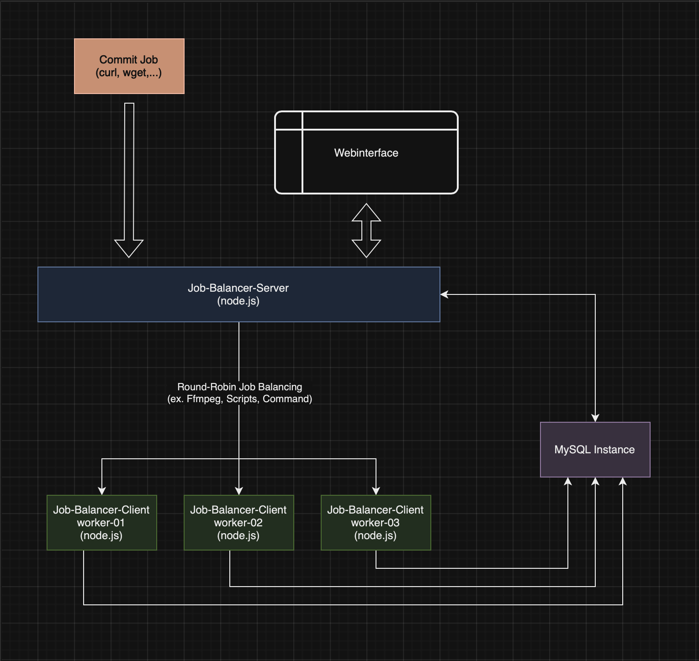

# Packages

- [Job-Balancer-Server](https://github.com/ChR-iSz/Job-Balancer-Server)
- [Job-Balancer-Client (this)](https://github.com/ChR-iSz/Job-Balancer-Client)

# Preface

The software consists of *two* parts: the "Job Balancer Server," which receives, distributes, and provides a web interface for jobs, and this "Job Balancer Client", which runs on the workers, executes, and logs jobs. Both apps connect to a shared SQL database that can be hosted separately or on the "Job Balancer Server." This project is currently in development and is not yet finalized in main branch. As such, consider "Job Balancer Server" and "Job Balancer Client" as BETA versions, not recommended for production use. A security review is also pending; thus, we recommend using it only in a secure network for now.

# Job Balancer Client (Worker)

The "Job Balancer Client" (Worker) is a Node.js application that operates as part of a distributed cluster along with the "Job Balancer Server". The client registers with the server as an available worker and promptly executes assigned jobs. This application facilitates the efficient distribution of computationally intensive or time-critical processes across multiple workers, maximizing processing speed.

## Problem Statement

Modern application scenarios frequently demand computationally intensive or time-critical processes. Executing such tasks on a single server can lead to bottlenecks and degrade overall performance. Moreover, there's a risk that a machine lacks sufficient resources to efficiently execute certain tasks. The outcome is prolonged processing times, increased latency, and a subpar user experience.

## Approach

The "Job Balancer Server" offers an elegant solution to tackle these challenges. It employs the round-robin algorithm to evenly distribute incoming jobs among available workers, ensuring equitable load distribution and optimal resource utilization.

The application supports an unlimited number of clients (workers), which can be grouped together into a cluster. This allows nearly linear scalability, permitting easy expansion of computing power by adding more workers as needed.

## Functionality

You submit an appropriate POST request using tools like curl, wget, or similar, from any machine to the Job Balancer Server application. The request includes the command to be executed on the worker or an ID (optionally with parameters) for a pre-configured script, conveniently created via the web interface in various languages.

The "Job Balancer Server" acknowledges the job request and promptly dispatches it to an available client (worker). The POST request can optionally include a watchdog time in seconds. After this duration, the job is forcefully terminated if it stalls or gets stuck in an unforeseen state (defunct).

If no free worker is available when transmitting the POST request, the job is marked as 'Occupied' (rejected) or set to 'Waiting' (to be processed later) based on the sent POST parameters (need_realtime: true, false) (default: false).

The web interface allows configuring various settings, such as the maximum number of jobs per worker, the job distribution algorithm, and more. Additionally, job statuses can be viewed, jobs can be restarted, terminated, or deleted during runtime, and a comprehensive log (STDOUT, STDERR) of jobs is accessible for analysis.

## Key Features

- Registration with the "Job Balancer Server" as an available worker.
- Execution of jobs assigned by the server.
- Capture and storage of job results and log files in the database.

## Installation of "Job Balancer Client"

1. Ensure that Node.js and npm are installed on your system.
2. Clone this repository to your server.
3. Navigate to the main application directory and run `npm install` to install dependencies.
4. Configure the application in the `config.jsonp` file.
5. Start the server with the command `node client.js`. (Running the app as 'root' is prohibited and results in an error message.)

The client will now register with the database as an available worker and is ready to execute assigned jobs.

## Job Execution

The "Job Balancer Server" decides which client executes which job. Once the server distributes a job to a client, it is promptly initiated. The client carries out the job and stores the result along with a log file in the database. The result and log file can be viewed through the server's web interface.

## General

We welcome contributions to enhance this project. If you have an idea or have identified an issue, please open an issue or submit a pull request.

## License

This project is licensed under the [MIT License](LICENSE).

## Copyright notice

Permission is hereby granted, free of charge, to any person obtaining a copy of this software and associated documentation files (the "Software"), to deal in the Software without restriction, including without limitation the rights to use, copy, modify, merge, publish, distribute, sublicense, and/or sell copies of the Software, and to permit persons to whom the Software is furnished to do so, subject to the following conditions.

The above copyright notice and this permission notice shall be included in all copies or substantial portions of the Software.

The software is provided "As is", without warranty of any kind, express or implied, including but not limited To the warranties of merchantability, fitness for a particular purpose and noninfringement. In no event shall The authors or copyright holders be liable for any claim, damages or other liability, whether in an action of Contract, tort or otherwise, arising from, out of or in connection with the software or the use or other Dealings in the software.

## Developer Environment

- Debian Buster (11.7)
- Mysql Server version: 10.5.19-MariaDB-0+deb11u2 Debian 11
- Node v20.5.0

## Images

